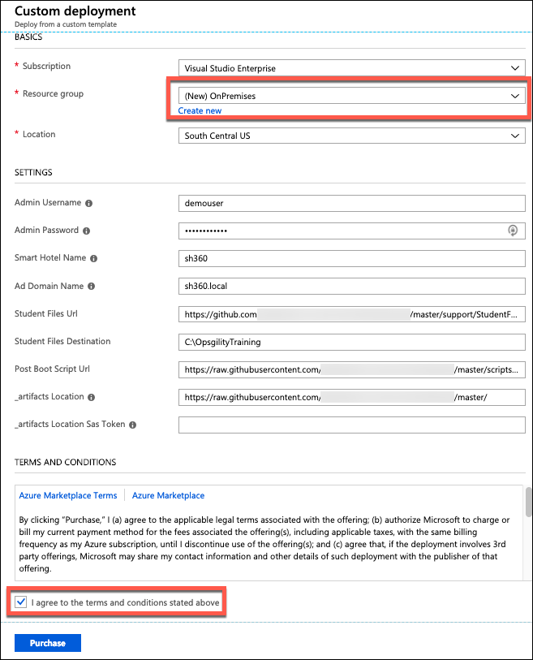
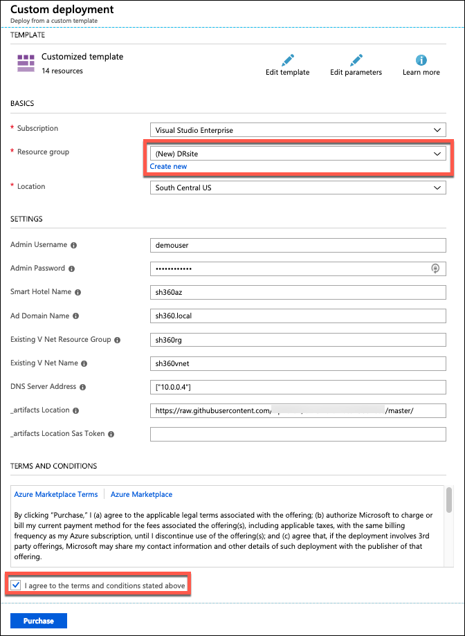
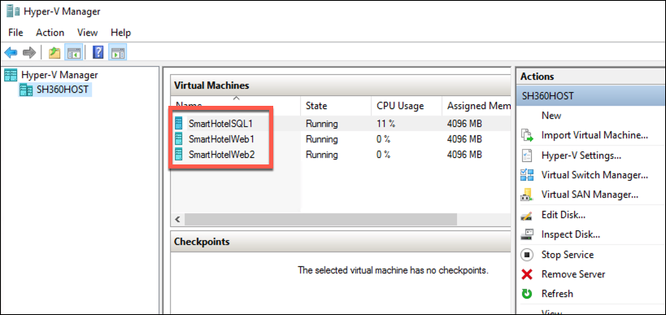
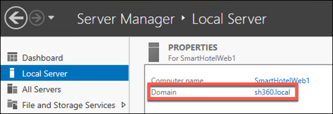
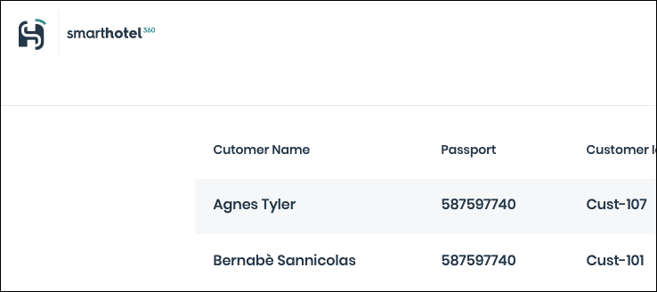

<div class="MCWHeader1">
SQL Server Hybrid Cloud
</div>

<div class="MCWHeader2">
Before the hands-on lab setup guide
</div>

<div class="MCWHeader3">
March 2019
</div>


Information in this document, including URL and other Internet Web site references, is subject to change without notice. Unless otherwise noted, the example companies, organizations, products, domain names, e-mail addresses, logos, people, places, and events depicted herein are fictitious, and no association with any real company, organization, product, domain name, e-mail address, logo, person, place or event is intended or should be inferred. Complying with all applicable copyright laws is the responsibility of the user. Without limiting the rights under copyright, no part of this document may be reproduced, stored in or introduced into a retrieval system, or transmitted in any form or by any means (electronic, mechanical, photocopying, recording, or otherwise), or for any purpose, without the express written permission of Microsoft Corporation.

Microsoft may have patents, patent applications, trademarks, copyrights, or other intellectual property rights covering subject matter in this document. Except as expressly provided in any written license agreement from Microsoft, the furnishing of this document does not give you any license to these patents, trademarks, copyrights, or other intellectual property.

The names of manufacturers, products, or URLs are provided for informational purposes only and Microsoft makes no representations and warranties, either expressed, implied, or statutory, regarding these manufacturers or the use of the products with any Microsoft technologies. The inclusion of a manufacturer or product does not imply endorsement of Microsoft of the manufacturer or product. Links may be provided to third party sites. Such sites are not under the control of Microsoft and Microsoft is not responsible for the contents of any linked site or any link contained in a linked site, or any changes or updates to such sites. Microsoft is not responsible for webcasting or any other form of transmission received from any linked site. Microsoft is providing these links to you only as a convenience, and the inclusion of any link does not imply endorsement of Microsoft of the site or the products contained therein.

© 2019 Microsoft Corporation. All rights reserved.

Microsoft and the trademarks listed at <https://www.microsoft.com/en-us/legal/intellectualproperty/Trademarks/Usage/General.aspx> are trademarks of the Microsoft group of companies. All other trademarks are property of their respective owners.

**Contents**

- [SQL Server Hybrid Cloud before the hands-on lab setup guide](#sql-server-hybrid-cloud-before-the-hands-on-lab-setup-guide)
  - [Requirements](#requirements)
  - [Before the hands-on lab](#before-the-hands-on-lab)
    - [Task 1: Deploy the on-premises environment](#task-1-deploy-the-on-premises-environment)
    - [Task 2: Deploy the Azure infrastructure to support your disaster recovery site](#task-2-deploy-the-azure-infrastructure-to-support-your-disaster-recovery-site)
    - [Task 2: Verify on-premises virtual machines domain join status](#task-2-verify-on-premises-virtual-machines-domain-join-status)
    - [Task 3: Verify the website is operational](#task-3-verify-the-website-is-operational)
  - [Summary](#summary)

# SQL Server Hybrid Cloud before the hands-on lab setup guide 

## Requirements

1.  Microsoft Azure Subscription

2.  Virtual Machine Built during this hands-on lab or local machine with the following:

    - Visual Studio 2017 Community or Enterprise Edition
    - Latest Azure PowerShell cmdlets:
        - <https://azure.microsoft.com/en-us/downloads/>
        - <https://docs.microsoft.com/en-us/powershell/azure/install-azurerm-ps>
        - Ensure you reboot after installing the SDK or Azure PowerShell may not work correctly.

## Before the hands-on lab

Duration: 60 minutes

In this exercise, you deploy an on-premises environment and the Azure infrastructure necessary to support the disaster recovery site in Azure. The on-premises environment will be hosted in an Azure Resource Group. 

### Task 1: Deploy the on-premises environment 

1.  Browse to the Azure portal at <https://portal.azure.com>and verify that you are logged in with the subscription that you wish to use for this lab.

    >**Note**: You may need to launch an \"in-private\" session in your browser if you have multiple Microsoft Accounts.

2.  Click the **Deploy to Azure** button below. 

    <a href="https://portal.azure.com/#create/Microsoft.Template/uri/https%3A%2F%2Fraw.githubusercontent.com%2Fciphertxt%2Fcw-smart-hotel-360-iaas%2Fmaster%2Ftemplate%2FSmartHotelOnPrem.json" rel="nofollow">
    </a>

3.  On the **Custom deployment** blade, select **Create new** under for the resource group and name the resource group ***OnPremises***. Accept the terms and conditions and click **Purchase**.
   
    

4. Wait for the deployment to complete. This may take up to 45 minutes.

5. Login to the Hyper-V host server, **sh360host**, using **demouser** for the login account and **demo@pass123** for the password. This will launch a run-once script to configure the virtual machines which you will protect with your DR configuration in Azure. 

    > **Note**: You may continue with the next task while this completes.

### Task 2: Deploy the Azure infrastructure to support your disaster recovery site

1.  Click the **Deploy to Azure** button below.

    <a href="https://portal.azure.com/#create/Microsoft.Template/uri/https%3A%2F%2Fraw.githubusercontent.com%2Fciphertxt%2Fcw-smart-hotel-360-iaas%2Fmaster%2Ftemplate%2FSmartHotelCloud.json" rel="nofollow">
    </a>

2.  On the **Custom deployment** blade, select **Create new** under for the resource group and name the resource group ***DRsite***. Accept the terms and conditions and click **Purchase**.

    

    > **Note**: If you used a different resource group name in the first deployment you will need to update it here as well.

3.  Wait for the deployment to complete. This will take up to 25 minutes.

### Task 2: Verify on-premises virtual machines domain join status 

1.  Login to your Hyper-V host server, **sh360host**.

2.  Launch the **Hyper-V Manager** application from within **sh360host**.

3.  Connect to each of the three virtual machines. Login with credentials **Administrator** with a password of **demo@pass123**

    

4.  After a minute or so, the Server Manager application should launch on its own. 

5.  Navigate to **Local Server** on the left side menu. Verify that the domain name is **sh360.local**

    

6.  If the machine has not joined the domain, open a PowerShell ISE window. Copy and paste the following code into the script editor. Changing the value of **$vmToJoinIP** to reflect the IP address of this server.

    ```
    Write-Output "Configuring VMs..."
    $vmToJoinIP = "192.168.0.N"
    $localusername = "Administrator"
    $password = ConvertTo-SecureString "demo@pass123" -AsPlainText -Force
    $localcredential = New-Object System.Management.Automation.PSCredential ($localusername, $password)
    $domainusername = "SH360\demouser"
    $domaincredential = New-Object System.Management.Automation.PSCredential ($domainusername, $password)

    Write-Output "Configuring VM at $vmToJoinIP..."
    Invoke-Command -ComputerName "192.168.0.$i" -ScriptBlock { 
    Add-Computer -DomainName "sh360.local" -Credential $Using:domaincredential -Restart -Force 
    } -Credential $localcredential
    Write-Output "Configuration complete"
    ```

7.  Repeat the above steps for the remaining servers.

### Task 3: Verify the website is operational 

1.  In the Azure portal, navigate to the **OnPremises** resource group. 

2.  Open the **sh360tm** Traffic Manager resource.

    

3.  Copy the **DNS name**.

4.  Paste the DNS name into a web browser. You should see the smart hotel web page.

    


## Summary

In this exercise, you deployed and validated your "On-Premises" environment and your Azure disaster recovery site. You also verified that all three servers have successfully joined the domain. In the lab you will reconfigure your on-premises environment for high availability.

You should follow all steps provided *before* attending the Hands-on lab.
