<div class="MCWHeader1">
SQL Server hybrid cloud
</div>

<div class="MCWHeader2">
Hands-on lab step-by-step
</div>

<div class="MCWHeader3">
June 2020
</div>

Information in this document, including URL and other Internet Web site references, is subject to change without notice. Unless otherwise noted, the example companies, organizations, products, domain names, e-mail addresses, logos, people, places, and events depicted herein are fictitious, and no association with any real company, organization, product, domain name, e-mail address, logo, person, place or event is intended or should be inferred. Complying with all applicable copyright laws is the responsibility of the user. Without limiting the rights under copyright, no part of this document may be reproduced, stored in or introduced into a retrieval system, or transmitted in any form or by any means (electronic, mechanical, photocopying, recording, or otherwise), or for any purpose, without the express written permission of Microsoft Corporation.

Microsoft may have patents, patent applications, trademarks, copyrights, or other intellectual property rights covering subject matter in this document. Except as expressly provided in any written license agreement from Microsoft, the furnishing of this document does not give you any license to these patents, trademarks, copyrights, or other intellectual property.

The names of manufacturers, products, or URLs are provided for informational purposes only and Microsoft makes no representations and warranties, either expressed, implied, or statutory, regarding these manufacturers or the use of the products with any Microsoft technologies. The inclusion of a manufacturer or product does not imply endorsement of Microsoft of the manufacturer or product. Links may be provided to third party sites. Such sites are not under the control of Microsoft and Microsoft is not responsible for the contents of any linked site or any link contained in a linked site, or any changes or updates to such sites. Microsoft is not responsible for webcasting or any other form of transmission received from any linked site. Microsoft is providing these links to you only as a convenience, and the inclusion of any link does not imply endorsement of Microsoft of the site or the products contained therein.

© 2020 Microsoft Corporation. All rights reserved.

Microsoft and the trademarks listed at https://www.microsoft.com/en-us/legal/intellectualproperty/Trademarks/Usage/General.aspx are trademarks of the Microsoft group of companies. All other trademarks are property of their respective owners.

**Contents**

<!-- TOC -->

- [SQL Server hybrid cloud hands-on lab step-by-step](#sql-server-hybrid-cloud-hands-on-lab-step-by-step)
  - [Abstract and learning objectives](#abstract-and-learning-objectives)
  - [Overview](#overview)
  - [Solution architecture](#solution-architecture)
  - [Requirements](#requirements)
    - [Help references](#help-references)
  - [Exercise 1: SQL Backup solution](#exercise-1-sql-backup-solution)
    - [Task 1: Create an Azure Storage Account](#task-1-create-an-azure-storage-account)
    - [Task 2: Configure managed backup in SQL Server](#task-2-configure-managed-backup-in-sql-server)
  - [Exercise 2: Implement a Data Archive Strategy with SQL Server Stretch Database](#exercise-2-implement-a-data-archive-strategy-with-sql-server-stretch-database)
    - [Task 1: Create a logical SQL Server to host Stretch DB](#task-1-create-a-logical-sql-server-to-host-stretch-db)
    - [Task 2: Identify tables that may benefit from Stretch DB](#task-2-identify-tables-that-may-benefit-from-stretch-db)
    - [Task 3: Implement Stretch DB based on date key](#task-3-implement-stretch-db-based-on-date-key)
  - [Summary](#summary)
  - [Exercise 3: Create an archive solution using table partitioning](#exercise-3-create-an-archive-solution-using-table-partitioning)
    - [Task 1: Create the archive database](#task-1-create-the-archive-database)
    - [Task 2: Create the new partitioned table](#task-2-create-the-new-partitioned-table)
    - [Task 3: Move data from the partitioned table to the archive database](#task-3-move-data-from-the-partitioned-table-to-the-archive-database)
  - [Summary](#summary-1)
  - [Exercise 4: Build SQL Availability Group for Database Disaster Recovery](#exercise-4-build-sql-availability-group-for-database-disaster-recovery)
    - [Task 1: Create the cluster](#task-1-create-the-cluster)
    - [Task 2: Create the SQL Server Availability Group](#task-2-create-the-sql-server-availability-group)
    - [Task 3: Create the Internal Load Balancer](#task-3-create-the-internal-load-balancer)
    - [Task 4: Validate the Availability Group](#task-4-validate-the-availability-group)
    - [Task 5: Update the Web Application to Connect to the Listener](#task-5-update-the-web-application-to-connect-to-the-listener)
    - [Summary](#summary-2)
  - [Exercise 5: Configure Azure Site Recovery for Web Tier DR](#exercise-5-configure-azure-site-recovery-for-web-tier-dr)
    - [Task 1: Create a Recovery Services Vault](#task-1-create-a-recovery-services-vault)
    - [Task 2: Configure Azure Site Recovery](#task-2-configure-azure-site-recovery)
    - [Task 3: Creating the Recovery Plan](#task-3-creating-the-recovery-plan)
  - [Exercise 6: Failing Over to the Disaster Recovery Site](#exercise-6-failing-over-to-the-disaster-recovery-site)
    - [Task 1: Failover the Data Tier](#task-1-failover-the-data-tier)
    - [Task 2: Failover the Web Tier](#task-2-failover-the-web-tier)
    - [Task 3: Validate Failover of the CloudShop application](#task-3-validate-failover-of-the-cloudshop-application)
  - [After the hands-on lab](#after-the-hands-on-lab)
    - [Task 1: Delete the resource groups created](#task-1-delete-the-resource-groups-created)

<!-- /TOC -->

# SQL Server hybrid cloud hands-on lab step-by-step 

## Abstract and learning objectives 

In this hands-on lab, you will build a disaster recovery site for an on-premises environment. You will enhance the existing database solution to support a hybrid cloud-based disaster recovery solution, implement an archiving strategy and a backup/restore strategy designed to protect data.

At the end of the lab, you will be better able to design and use availability sets, Managed Disks, SQL Server Always on Availability Groups, Stretch DB and SQL Server Managed Backup.

## Overview

Contoso has asked you to deploy their infrastructure in a resilient manner to ensure their infrastructure will be available for their users and gain an SLA from Microsoft.

## Solution architecture

Cloud based disaster recovery site.

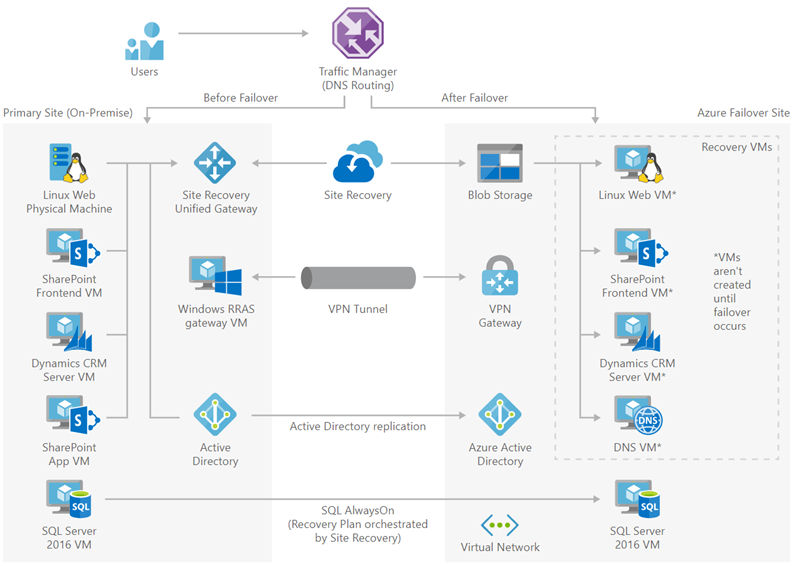

## Requirements

1. Microsoft Azure Subscription

2. Virtual Machine Built during this hands-on lab or local machine with the following:

    - Latest Azure PowerShell cmdlets:
        - <https://azure.microsoft.com/en-us/downloads/>
        - <https://docs.microsoft.com/en-us/powershell/azure/install-azurerm-ps>
        - Ensure you reboot after installing the SDK or Azure PowerShell may not work correctly.

### Help references

|    |            |
|----------|:-------------:|
| **Description** | **Links** |
| Authoring ARM Templates | <https://azure.microsoft.com/en-us/documentation/articles/resource-group-authoring-templates/> |
| Virtual Machine Scale Set Samples | <https://github.com/gbowerman/azure-myriad> |
| Azure Quick Start Templates | <https://github.com/Azure/azure-quickstart-templates> |
| Network Security Groups | <https://azure.microsoft.com/en-us/documentation/articles/virtual-networks-nsg/> |
| Managed Disks | <https://azure.microsoft.com/en-us/services/managed-disks> |
| Always-On Availability Groups | <https://docs.microsoft.com/en-us/sql/database-engine/availability-groups/windows/overview-of-always-on-availability-groups-sql-server?view=sql-server-2017> |
| SQL Server Managed Backup to Azure | <https://docs.microsoft.com/en-us/sql/relational-databases/backup-restore/sql-server-managed-backup-to-microsoft-azure?view=sql-server-2017> |
| Virtual Network Peering | <https://docs.microsoft.com/en-us/azure/virtual-network/virtual-network-peering-overview> |
| Azure Backup |  <https://azure.microsoft.com/en-us/services/backup/> |

## Exercise 1: SQL Backup solution

Duration: 30 minutes

Backups must be maintained offsite from the on-premises environment. The backups must be online and accessible by the DBA team. To accomplish this, you will configure SQL Managed Backup.

### Task 1: Create an Azure Storage Account

In this task, you will create an Azure Storage Account for use with SQL Managed Backup.

1. Connect to your CloudShopSQL virtual machine by navigating to your **CloudShop1** resource group and then connecting to the **CloudShopSQL**  virtual machine.

2. Login with username **demouser** and password **demo@pass123**.

3. Launch **Server Manager**, select **Local Server** from the menu on the left and verify that **IE Enhanced Security Configuration** is set to **Off**.

    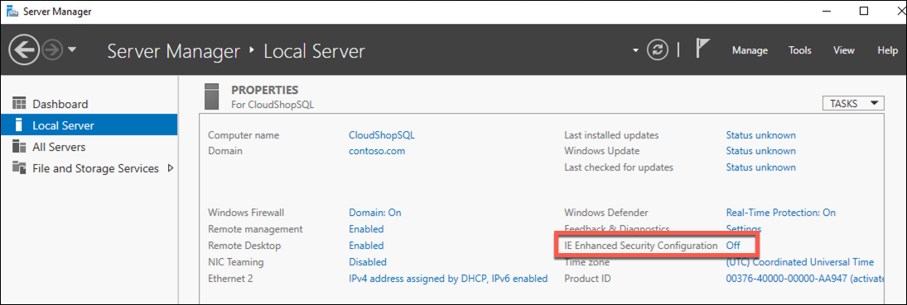

4. From within your SQL Server guest virtual machine, install Azure PowerShell by launching an **administrative PowerShell ISE session** and running the following command. Accept any warnings or authorization to install the components.

    ```powershell
    Install-Module -Name Az -AllowClobber -Scope AllUsers
    ```

5. From the PowerShell ISE, type the following at the prompt and follow the prompts to login to your Azure subscription:

    ```powershell
    login-AzAccount
    ```

6. Execute the following PowerShell commands in the PowerShell ISE to create a new storage account and generate the T-SQL needed to configure managed backup for the database. Before executing the script:

   - Change the **$storageAcctName** variable to a unique name.
   - Change the location to match the location you are deploying into for this lab.

    ```powershell
    $storageAcctName = "[unique storage account name]"

    $resourceGroupName = "CloudShop2"
    $containerName= "backups"
    $location = "[choose the same region you used to deploy the CloudShop2 resource group]"
    $storageSkuName = "Standard_LRS"

    "Creating Storage Account $storageAcctName"
    $sa = New-AzStorageAccount -ResourceGroupName $resourceGroupName  `
        -Name $storageAcctName `
        -Location $location `
        -Type $storageSkuName 

    
    $storageKey = Get-AzStorageAccountKey -ResourceGroupName $resourceGroupName -Name $storageAcctName

    $context = New-AzStorageContext -StorageAccountName $storageAcctName -StorageAccountKey $storageKey[0].Value

    Write-Host "Creating New Storage Container  $containerName" 
    New-AzStorageContainer -name $containerName -context $context

    $fullSasToken = New-AzStorageContainerSASToken -Name $containerName -Permission rwdl -FullUri -Context $context  
    $containerUrl = $fullSasToken.Substring(0,$fullSasToken.IndexOf("?"))
    $sasToken = $fullSasToken.Substring($fullSasToken.IndexOf("?")+1)

    $enableManagedBackupScript = @"
    --------------------
    ---BEGIN TSQL Script
    --------------------
    CREATE CREDENTIAL [$containerUrl]
    WITH IDENTITY = 'Shared Access Signature',
         SECRET = '$sasToken'

    GO

    EXEC msdb.managed_backup.sp_backup_config_basic
     @enable_backup = 1,
     @database_name = 'AdventureWorks',  
     @container_url = '$containerUrl',
     @retention_days = 30

     --------------------
     ---END TSQL Script
     --------------------
    "@

    Write-Host $enableManagedBackupScript
    ```

    >**Note**: Due to differences between markdown and PowerShell formatting requirements, you may need to remove the white space prior to the **\"\@** near the end of the file.

7. Save the T-SQL code generated between the **Begin TSQL Script** and **End TSQL Script** in your PowerShell ISE output after execution into a notepad file. This code creates an identity using a Shared Access Signature (SAS) to a container in the storage account and configures managed backup when executed.

### Task 2: Configure managed backup in SQL Server

1. From within your SQL Server virtual machine, launch SQL Server Management Studio and connect to the local database instance, expand databases, and select the **AdventureWorks** database.

2. From within SQL Server Management Studio, select **New Query**.

    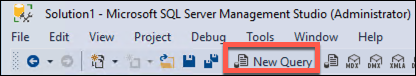

3. Refresh SQL Server Management Studio and if SQL Server Agent is stopped right-click on it and select Start.

    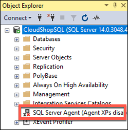

4. Paste in the following code and select **Execute** to enable SQL Server Agent extended stored procedures. After running the code, right-click the SQL Server Agent and select **Start**.

    ```sql
    EXEC sp_configure 'show advanced options', 1
    GO
    RECONFIGURE
    GO
    EXEC sp_configure 'Agent XPs', 1
    GO
    RECONFIGURE
    GO
    ```

5. Paste the T-SQL code you copied at the end of the previous task into the query window replacing the existing code and select **Execute**. An example of the code is below. This code creates the new SQL identity with a Shared Access Signature for your storage account. 

    ```sql
    #sample only do not execute
    CREATE CREDENTIAL [https://<your_storage_account>.blob.core.windows.net/backups]
    WITH IDENTITY = 'Shared Access Signature',
    SECRET = '<your_sas_token>'
    GO

    EXEC msdb.managed_backup.sp_backup_config_basic
        enable_backup = 1,
        @database_name = 'AdventureWorks',
        @container_url = 'https://<your_storage_account>.blob.core.windows.net/backups',
        @retention_days = 30
    ```

6. Paste the code below into the query window replacing the existing code and select **Execute** to create a custom backup schedule.

    ```sql
    USE msdb;  
    GO  
    EXEC managed_backup.sp_backup_config_schedule   
         @database_name =  'AdventureWorks'  
        ,@scheduling_option = 'Custom'  
        ,@full_backup_freq_type = 'Weekly'  
        ,@days_of_week = 'Monday'  
        ,@backup_begin_time =  '17:30'  
        ,@backup_duration = '02:00'  
        ,@log_backup_freq = '00:05'  
    GO
    ```

7. Execute the following T-SQL in the query window to generate a backup on-demand. You can also specify Log for \@type to generate a transaction log backup.

    ```sql
    EXEC msdb.managed_backup.sp_backup_on_demand
    @database_name  = 'AdventureWorks',
    @type ='Database'
    ```

8. To verify that your backups are working, go to the Azure portal, navigate to your **CloudShop2** resource group. Open the storage account you just created, select the **Blobs** tile, then the **backups** container. You should see your backups here.

## Exercise 2: Implement a Data Archive Strategy with SQL Server Stretch Database

Duration: 30 minutes

There are numerous ways to implement an archive strategy in SQL Server. The easiest way to do this is through the SQL Server Stretch Database feature. A more common approach is to leverage table partitioning to separate historical data from current data. If you wish to implement table partitioning to archive data skip to **Exercise 3**.

In this exercise, you will implement SQL Server Stretch Database to stretch data from a table into Azure.

### Task 1: Create a logical SQL Server to host Stretch DB

1. From your **CloudShopSQL** virtual machine, launch a browser, navigate to the Azure portal and login with your Azure credentials.

2. Select **+Create a resource** at the top of the left side menu.

3. Type **SQL Server logical server** into the search box, hit enter and choose **SQL server (logical server)** from the search results.

    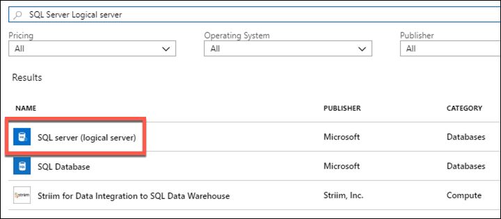

4. Select **Create** on the SQL Server (logical server) information blade.

5. On the Create SQL Database Server Basics tab, use the following configurations and select **Next:Networking**.

    - Subscription: ***Your subscription***.
    - Resource group: **CloudShop2**
    - Server name: ***Choose a unique server name***. *Make note of the server name you chose. It will be used in a later task.*
    - Location: ***Use the same location you used for CloudShop2***.
    - Server admin login: **demouser**
    - Password: **demo@pass123**

        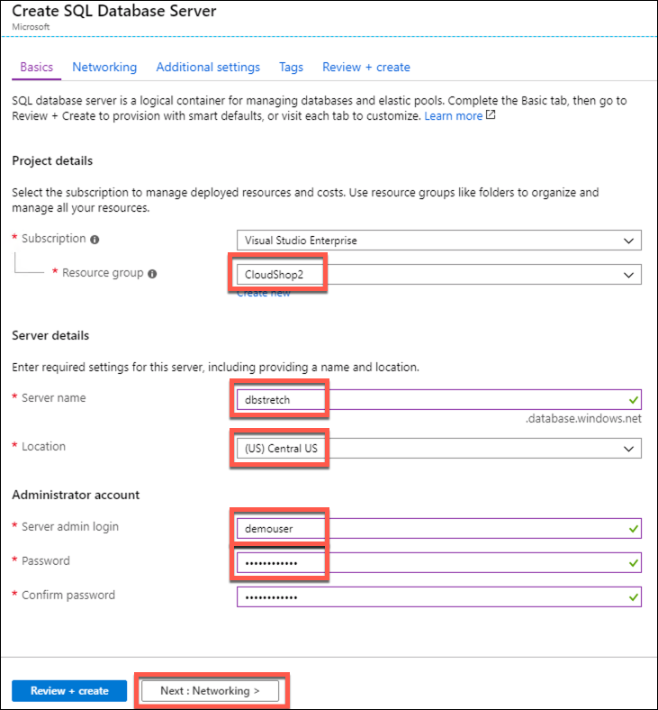

6. On the Networking tab, enable the firewall rule to allow Azure services and resources to access this server then select **Review + Create**.

    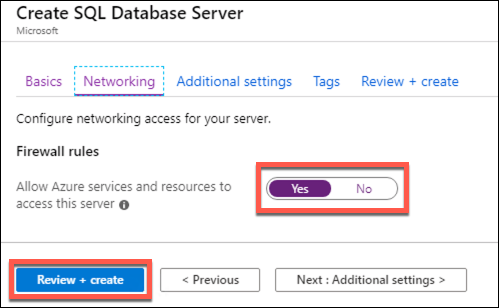

7. Select **Create** on the Review + create tab.

8. After the SQL Server logical server has deployed, navigate to it and select **Firewalls and virtual networks** from the security menu on the left.

    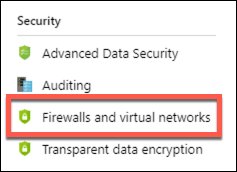

9. Add a new firewall rule by selecting **+Add client IP** and then selecting **Save**.

    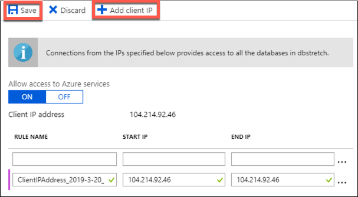

### Task 2: Identify tables that may benefit from Stretch DB

1. From your **CloudShopSQL** virtual machine, launch SQL Server Management Studio if it is not already open.

2. In the SQL Server Management Studio Object Explorer, connect to your local SQL Server instance and expand the Databases folder.

3. Right-click the AdventureWorks database, select Tasks, select Stretch, then choose Enable.

    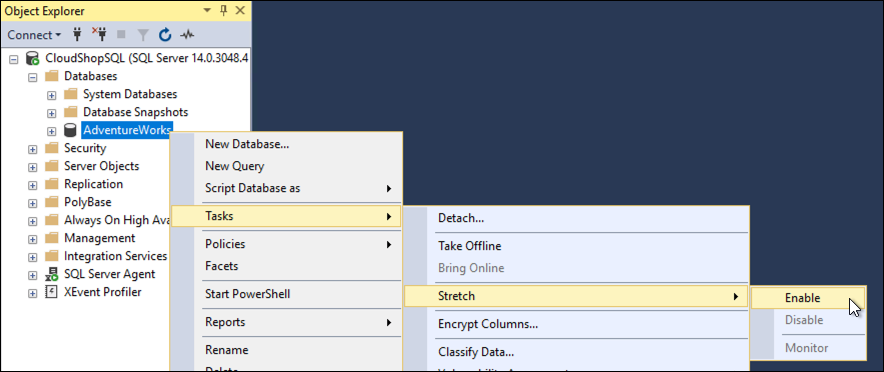

4. The Enable Database for Stretch wizard should open automatically. Select **Next** on the Introduction screen.

5. On the Select tables window all of your tables will be listed. Notice that some tables have warnings, and some may be greyed out. Select the warning icon next to one of the tables. This indicates that the table does not meet the StretchDB eligibility requirements.

    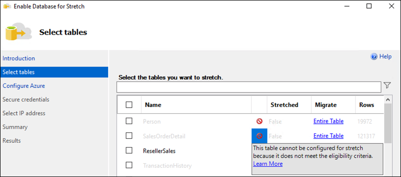

6. Scroll to the right until you see the Migrate column. Selecting Entire Table on an eligible table allows you to define which rows will be migrated to Azure. In this lab, we are going to configure Stretch Database through TSQL. Select Cancel to break out of the wizard.

### Task 3: Implement Stretch DB based on date key  

1. Launch a new Query tab and execute the following code to prepare the server and the database for Stretch Database:

    ```sql
    --Enable the server for Stretch Database
    EXEC sp_configure 'remote data archive' , '1';
    GO
    RECONFIGURE;
    GO

    --Create a database master key to encrypt the data stored in Azure
    USE [AdventureWorks]
    GO
    CREATE MASTER KEY ENCRYPTION BY PASSWORD='demo@pass123'
    GO

    --Create the credential used to access an Azure SQL Database
    CREATE DATABASE SCOPED CREDENTIAL StretchDB 
    WITH IDENTITY = 'demouser' , SECRET = 'demo@pass123'
    GO
    ```

2. Execute the following code replacing the server name with the name of the SQL Server you created in Exercise 1. This code enables Stretch Database on your database. It may take a few minutes to complete.

    ```sql
    --Enable the local database for stretch
    --You must change your server name to match your environment
    ALTER DATABASE [AdventureWorks]
    SET REMOTE_DATA_ARCHIVE = ON (SERVER = N'<your server name>.database.windows.net', CREDENTIAL = StretchDB )
    ```

3. Execute the following code to create the stretch predicate. The stretch predicate allows us to define the conditions under which a row will be stretched. In this case the function leverages a date key column to stretch any rows prior to January 1, 2002. 

    ```sql
    --Create the stretch predicate
    CREATE FUNCTION dbo.fn_stretch_datekey_predicate(@column1 int)
    RETURNS TABLE
    WITH SCHEMABINDING
    AS
    RETURN SELECT 1 AS is_eligible
        WHERE @column1 < '20020101'
    GO
    ```

4. Execute the following to begin the migration of eligible data to your Azure SQL Database:

    ```sql
    --Enable stretch on the table using the stretch predicate with the OrderDateKey
    ALTER TABLE Sales.ResellerSales
    SET ( REMOTE_DATA_ARCHIVE = ON (
        FILTER_PREDICATE =
        dbo.fn_stretch_datekey_predicate([OrderDateKey]),
    MIGRATION_STATE = OUTBOUND
    ) )
    ```

5. Refresh the AdventureWorks database in Object Explorer by right-clicking on it and choosing Refresh.

6. Right-click the AdventureWorks database, choose Tasks, Stretch, then select Monitor.

7. View the stretch database report. Note that over time the Eligible Rows, Local Rows, and Rows In Azure numbers will change as data is migrated to your Stretch Database in Azure.

    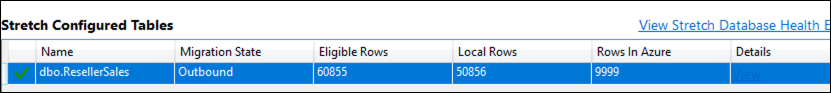

8. Select the dropdown under Migration State. Notice that you have the option to pause the outbound migration.

9. Launch a new Query tab and execute the following code to programmatically monitor space used in Azure and locally.

    ```sql
    sp_spaceused 'Sales.ResellerSales', @mode = 'REMOTE_ONLY'
    GO
    sp_spaceused 'Sales.ResellerSales', @mode = 'LOCAL_ONLY'
    GO
    ```

10. You may also change the scope of a query.

    ```sql
    SELECT COUNT(*) FROM [Sales].[ResellerSales] WITH (REMOTE_DATA_ARCHIVE_OVERRIDE = REMOTE_ONLY)
    ```

## Summary

In this exercise, you implemented an archive solution with Stretch Database. First, you reviewed the table compatibility by using the Enable Database for Stretch wizard. You then configured your database and table via T-SQL to archive data satisfied by a stretch predicate. Finally, you reviewed the progress, status and space used locally and in Azure via the built-in management tools

## Exercise 3: Create an archive solution using table partitioning

Duration: 60 minutes

In this exercise, you will create an archive solution using table partitioning. The goal of partitioning the table is to minimize the impact of the archival process on the production database and to minimize the size of the database overall to improve performance of the maintenance jobs. We will use monthly partitions to accomplish these goals.

> **Note**: This is an alternate archive solution. It is not necessary to complete this exercise if you have already completed exercise 2.

### Task 1: Create the archive database

In this task, you will create the archive database to store historical data from large tables in the production database.

1.  From your **CloudShopSQL** virtual machine, launch SQL Server Management Studio and login to the local instance of SQL Server.

2.  Open a new query window, copy and paste the following code into the query window. This code creates the archive database where you will store historical data from the production database.

    ```sql
    -- Create archive database
    CREATE DATABASE AdventureWorksArchive
    ```

3.  Open a new query window, copy and paste the following code into the query window. This creates a table you will store historical data from the **AdventureWorks.Sales.ResellerSales** table. You will copy data into this table in a later step.

    ```sql
    USE AdventureWorksArchive
    GO
    CREATE TABLE ResellerSalesArchive (
  	    [ProductKey] [int] NOT NULL,
	    [OrderDateKey] [int] NOT NULL,
	    [DueDateKey] [int] NOT NULL,
	    [ShipDateKey] [int] NOT NULL,
	    [ResellerKey] [int] NOT NULL,
	    [EmployeeKey] [int] NOT NULL,
	    [PromotionKey] [int] NOT NULL,
	    [CurrencyKey] [int] NOT NULL,
	    [SalesTerritoryKey] [int] NOT NULL,
	    [SalesOrderNumber] [nvarchar](20) NOT NULL,
	    [SalesOrderLineNumber] [tinyint] NOT NULL,
	    [RevisionNumber] [tinyint] NULL,
    	[OrderQuantity] [smallint] NULL,
	    [UnitPrice] [money] NULL,
	    [ExtendedAmount] [money] NULL,
	    [UnitPriceDiscountPct] [float] NULL,
	    [DiscountAmount] [float] NULL,
	    [ProductStandardCost] [money] NULL,
	    [TotalProductCost] [money] NULL,
	    [SalesAmount] [money] NULL,
	    [TaxAmt] [money] NULL,
	    [Freight] [money] NULL,
	    [CarrierTrackingNumber] [nvarchar](25) NULL,
	    [CustomerPONumber] [nvarchar](25) NULL
    );
    ```

### Task 2: Create the new partitioned table

In this task, we will create a new partitioned table which will be used to hold the current data. Applications, stored procedures may require updates to be able to use the table.

1.  From SQL Server Management Studio on your **CloudShopSQL** virtual machine, open a new query window.

2.  Create a partition function for the new partitioned table that you will create. For now, we will create the table with enough partitions to accommodate all of the data that is currently in the Sales.ResellersSales table. Paste the following code into your query window and execute it.

    ```sql
    USE AdventureWorks
    GO
    CREATE PARTITION FUNCTION pfResellerSales (int)
    AS RANGE RIGHT FOR VALUES 
    ('20010801','20010901','20011001','20011101','20011201'
    ,'20020101','20020201','20020301','20020401','20020501','20020601','20020701','20020801','20020901','20021001','20021101','20021201'
    ,'20030101','20030201','20030301','20030401','20030501','20030601','20030701','20030801','20030901','20031001','20031101','20031201'
    ,'20040101','20040201','20040301','20040401','20040501','20040601');
    ```

3.  Create the partition scheme for your table. Copy, paste and execute the following code into a new query window.

    ```sql
    CREATE PARTITION SCHEME psResellerSales
    AS PARTITION pfResellerSales
    ALL TO ([Primary]);
    ```

4.  Create the new partitioned table using the partition scheme defined in the previous step. Copy, paste and execute the following code into a new query window.

    ```sql
    -- Create the new partitioned table on the Partition Scheme
    CREATE TABLE Sales.ResellerSalesCurrent (
  	    [ProductKey] [int] NOT NULL,
	    [OrderDateKey] [int] NOT NULL,
	    [DueDateKey] [int] NOT NULL,
	    [ShipDateKey] [int] NOT NULL,
	    [ResellerKey] [int] NOT NULL,
	    [EmployeeKey] [int] NOT NULL,
	    [PromotionKey] [int] NOT NULL,
	    [CurrencyKey] [int] NOT NULL,
	    [SalesTerritoryKey] [int] NOT NULL,
	    [SalesOrderNumber] [nvarchar](20) NOT NULL,
	    [SalesOrderLineNumber] [tinyint] NOT NULL,
	    [RevisionNumber] [tinyint] NULL,
	    [OrderQuantity] [smallint] NULL,
	    [UnitPrice] [money] NULL,
	    [ExtendedAmount] [money] NULL,
	    [UnitPriceDiscountPct] [float] NULL,
	    [DiscountAmount] [float] NULL,
	    [ProductStandardCost] [money] NULL,
	    [TotalProductCost] [money] NULL,
	    [SalesAmount] [money] NULL,
	    [TaxAmt] [money] NULL,
	    [Freight] [money] NULL,
	    [CarrierTrackingNumber] [nvarchar](25) NULL,
	    [CustomerPONumber] [nvarchar](25) NULL
    ) ON psResellerSales(OrderDateKey);
    ```

5.  Load the data from **Sales.ResellerSales** into your new table by executing the following statement in a new query window in SQL Server Management Studio.

    ```sql
    -- Load the new partitioned table
    INSERT INTO Sales.ResellerSalesCurrent
    SELECT * FROM Sales.ResellerSales
    ```
6.  Create a partition aligned clustered index on the new partitioned table.

    ```sql
    -- Create partition aligned clustered index
    CREATE CLUSTERED INDEX IX_ResellerSalesCurrent_OrderDateKey
    ON Sales.ResellerSalesCurrent (OrderDateKey)
    WITH (STATISTICS_NORECOMPUTE = OFF, IGNORE_DUP_KEY = OFF,
         ALLOW_ROW_LOCKS = ON, ALLOW_PAGE_LOCKS = ON)
    ON psResellerSales(OrderDateKey)
    ```

### Task 3: Move data from the partitioned table to the archive database

In this task, you will move data from the new partitioned table to the table in your archive database. This will be done by switching out the oldest partition into a work table and copying the data from the work table to the archive table. We could just write a query to accomplish this without partitioning, however, this method minimizes the impact on the production table as the partition switch is very fast.

1.  From SQL Server Management Studio on your **CloudShopSQL** virtual machine, open a new query window.

2.  Copy and paste the following code into the query window and execute it. This code creates the work table that we will switch our oldest partition into. The table must be identical to the original table including indexing.

    ```sql
    USE AdventureWorks
    GO
    -- Create the work table
    -- This is the table we will switch out to
    CREATE TABLE Sales.ResellerSalesWork (
  	    [ProductKey] [int] NOT NULL,
	    [OrderDateKey] [int] NOT NULL,
	    [DueDateKey] [int] NOT NULL,
	    [ShipDateKey] [int] NOT NULL,
	    [ResellerKey] [int] NOT NULL,
	    [EmployeeKey] [int] NOT NULL,
	    [PromotionKey] [int] NOT NULL,
	    [CurrencyKey] [int] NOT NULL,
	    [SalesTerritoryKey] [int] NOT NULL,
	    [SalesOrderNumber] [nvarchar](20) NOT NULL,
	    [SalesOrderLineNumber] [tinyint] NOT NULL,
	    [RevisionNumber] [tinyint] NULL,
	    [OrderQuantity] [smallint] NULL,
	    [UnitPrice] [money] NULL,
	    [ExtendedAmount] [money] NULL,
	    [UnitPriceDiscountPct] [float] NULL,
	    [DiscountAmount] [float] NULL,
	    [ProductStandardCost] [money] NULL,
	    [TotalProductCost] [money] NULL,
	    [SalesAmount] [money] NULL,
	    [TaxAmt] [money] NULL,
	    [Freight] [money] NULL,
	    [CarrierTrackingNumber] [nvarchar](25) NULL,
	    [CustomerPONumber] [nvarchar](25) NULL
    );

    --Create the clustered index on the work table
    CREATE CLUSTERED INDEX IX_ResellerSalesWork_OrderDateKey
    ON Sales.ResellerSalesWork (OrderDateKey)
    WITH (STATISTICS_NORECOMPUTE = OFF, IGNORE_DUP_KEY = OFF,
         ALLOW_ROW_LOCKS = ON, ALLOW_PAGE_LOCKS = ON)
    ```

3.  Before we move any data let's take a look at how our data is distributed across our existing partitions. Execute the following code in SQL Server Management Studio.

    ```sql
    -- View partition info
    SELECT o.name objectname,i.name indexname, partition_id, partition_number, [rows]
    FROM sys.partitions p 
    INNER JOIN sys.objects o ON o.object_id=p.object_id
    INNER JOIN sys.indexes i ON i.object_id=p.object_id and p.index_id=i.index_id
    WHERE o.name LIKE '%ResellerSales%'
    ```

4.  Notice that partition number 1 of the ResellerSalesCurrent table has 352 rows and that partition 1 of the ResellerSalesWork table has 0 rows. We will switch these two partitions.

    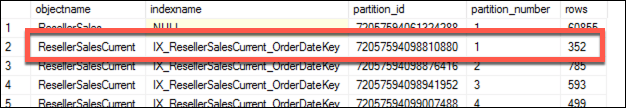

    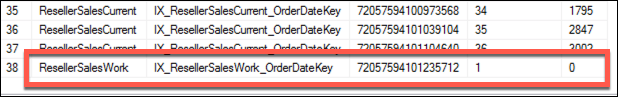

5.  To switch the oldest partition from the current table to the work table, execute the following code.

    ```sql
    -- Execute a switch
    ALTER TABLE Sales.ResellerSalesCurrent SWITCH PARTITION 1 TO Sales.ResellerSalesWork;
    ```

6.  Now run the following query again and notice that the work table now contains 352 rows while partition 1 of the ResellerSalesCurrent table now contains 0 rows. This indicates that our switch was successful. 

    ```sql
    -- View partition info
    SELECT o.name objectname,i.name indexname, partition_id, partition_number, [rows]
    FROM sys.partitions p 
    INNER JOIN sys.objects o ON o.object_id=p.object_id
    INNER JOIN sys.indexes i ON i.object_id=p.object_id and p.index_id=i.index_id
    WHERE o.name LIKE '%ResellerSales%'    
    ```

    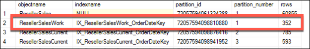
    
    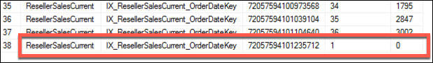

7.  Now we need to create a new partition for the upcoming month. To do this we execute a split, specifying the new range for the next partition.

    ```sql
    -- Create new partition
    ALTER PARTITION FUNCTION pfResellerSales() SPLIT RANGE ('20040701');
    ```

8.  We need to clean up the now empty partition. To do this we execute a merge and specify the new lower boundary on our production table.

    ```sql
    -- Merge empty partition
    ALTER PARTITION FUNCTION pfResellerSales() MERGE RANGE ('20010801');
    ```

9.  Now let's copy the data to the archive database and create the necessary indexes by executing the following code. Since we are copying data from the worktable, there should be no adverse impact on the production table.

    ```sql
    INSERT INTO AdventureWorksArchive..ResellerSalesArchive
    SELECT * FROM AdventureWorks.Sales.ResellerSalesWork

    USE AdventureWorksArchive
    GO
    CREATE CLUSTERED INDEX IX_ResellerSalesWork_OrderDateKey
    ON ResellerSalesArchive (OrderDateKey)
    WITH (STATISTICS_NORECOMPUTE = OFF, IGNORE_DUP_KEY = OFF,
         ALLOW_ROW_LOCKS = ON, ALLOW_PAGE_LOCKS = ON)
    ```

10. After the copy completes, you should cleanup the work table so that it can be used to move the other partitions in the future.

    ```sql
    USE AdventureWorks
    GO
    TRUNCATE TABLE Sales.ResellerSalesWork
    ```

11. To support our legacy reports, we will need to create a view that unions both the current table and the archive table using the same table name as the original table. To do this we must first drop the original table (or rename it). Execute the following code to drop the existing Sales.ResellerSales table and create a view to take its place.

    ```sql
    USE AdventureWorks
    GO

    DROP TABLE Sales.ResellerSales
    GO

    CREATE VIEW Sales.ResellerSales
    AS SELECT * FROM AdventureWorksArchive..ResellerSalesArchive 
       UNION ALL 
       SELECT * FROM Sales.ResellerSalesCurrent
    ```

12. Execute the following code to verify that you are returning 60855 rows.

    ```sql
    SELECT COUNT(*) FROM Sales.ResellerSales
    ```

## Summary

In this exercise, you implemented an archive solution with table partitioning. You created a partitioned table to replace the existing Sales.ResellerSales table. You allowed the legacy reports to maintain access to the current and historical data by creating a view across both the historical archive table and the new current data stored in the partitioned table. 

## Exercise 4: Build SQL Availability Group for Database Disaster Recovery

Duration: 60 minutes

In this exercise, you will build a SQL Always-On Cluster for resiliency of the data tier.

### Task 1: Create the cluster

In this task, you will create the underlying Windows Failover Cluster which is the base of your SQL Server Availability Group. You will begin by logging in with an account with administrative privileges on all of the prospective nodes of the cluster and running a Failover Cluster Validation test. This test verifies that all the nodes of your cluster are properly configured to support clustering and will flag any best practices that you may not be adhering to in your configuration. Finally, you will create the cluster across the three nodes of you cluster.

1. Launch a browser and navigate to <https://portal.azure.com>. Login with your Azure credentials if you haven't already.

    > **Note**: You may need to launch an \"in-private\" session in your browser if you have multiple Microsoft Accounts.

2. Navigate to your **CloudShop1** resource group and open your **CloudShopSQL** virtual machine and connect to it via Remote Desktop.

3. Login with the **CONTOSO\demouser** domain account with password **demo@pass123**. 
    > **Note**: This is NOT the same account that you have been using, this is a domain account. You must use a domain account that is an local administrator on all nodes of the cluster to properly configure Windows Failover Clustering.

4. Launch Server Manager if it does not start automatically.

5. Select **Local Server** from the menu on the left and scroll down to **Roles and Features**, select the **Tasks** dropdown and select **Add Roles and Features** from the list.

    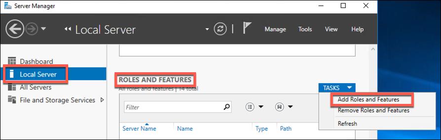

6. On the **Before you begin** page, select **Next**.

7. On the **Select installation type** page, select **Role-based or feature-based installation** and select **Next**.

8. On the **Select destination server** page, select the current server and select **Next**.

9.  On the **Select server roles** page, accept the defaults and select **Next**.

10. On the **Select features** page, select **Failover Clustering**, then verify that **Include management tools** is checked and select **Add Features** on the popup and then select **Next**.

    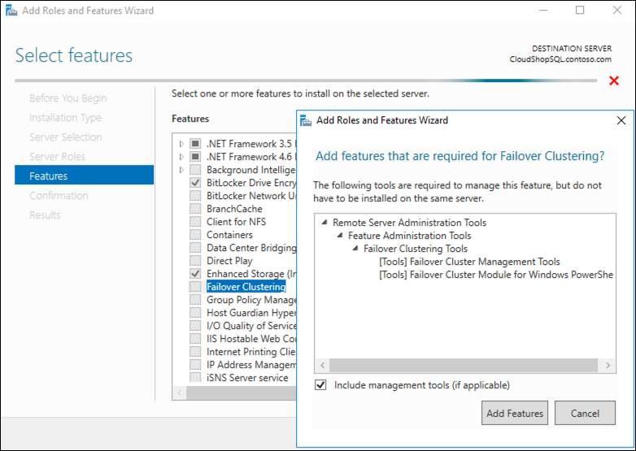

11. On the **Confirm installation selections** page, select **Install**.

12. Repeat the above steps to install Failover Clustering on your remaining SQL Servers (CloudShopSQL2 and CloudShopSQL3).

    >**Note**: CloudShopSQL2 and CloudShopSQL3 were deployed to the disaster recovery site which is hosted in the **CloudShopSQL2** resource group.

13. From CloudShopSQL, open **Administrative Tools** and then launch **Failover Cluster Manager**.

14. From the Actions pane on the right, choose **Validate Configuration**.

    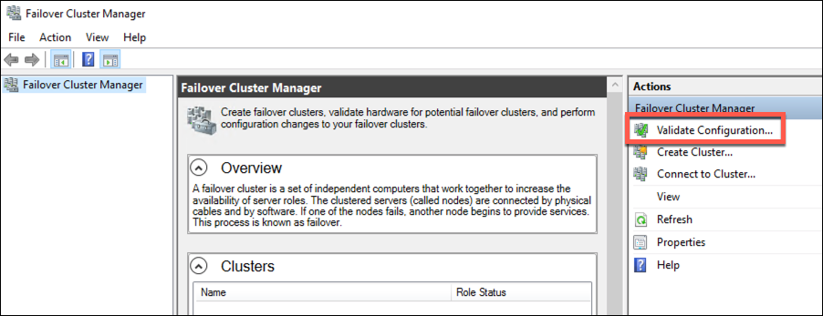

15. Select **Next** on the Before You Begin window.

16. On the Select Servers or a Cluster window, enter **CloudShopSQL** and then select the **Add** button. Repeat for **CloudShopSQL2** and **CloudShopSQL3** then select **Next**.

    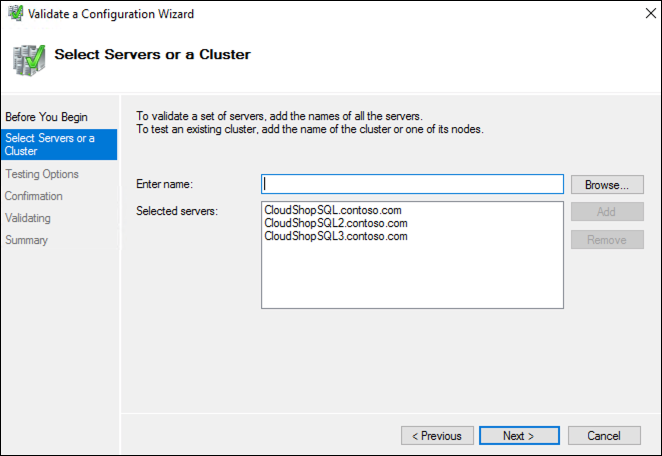

17. On the Testing Options window, select the **Run only tests I select** radio button and select **Next**.

    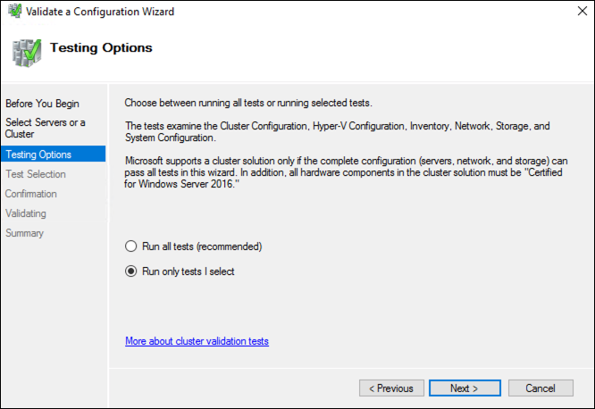

18. On the Test selection window, uncheck storage. The storage tests have no relevance for our case and will only throw additional warnings.

    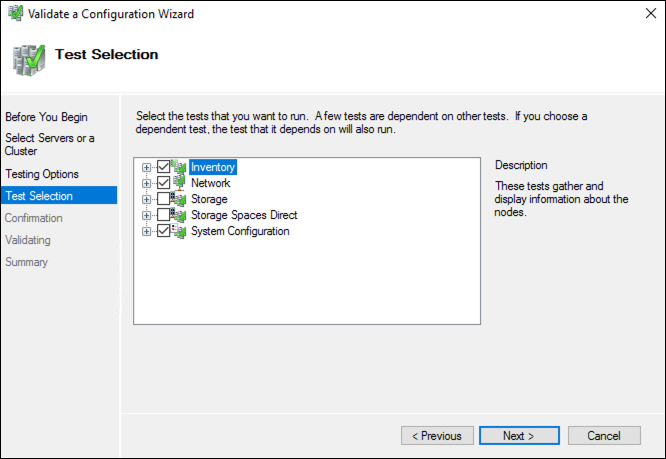

19. On the Confirmation window, select **Next** to begin the validation tests.

20. Review the output of the tests by selecting the **View Report** button. This validation test aids you in determining if your server and network configuration is correctly configured for Windows Failover Clustering. You should review any warnings or errors. In our case, the environment was preconfigured to support clustering so there should be no errors. There may be warnings regarding best practices such as multiple network cards etc. In a production environment these warnings must be taken seriously as they may adversely affect the performance and reliability of the cluster. In our lab they will have a negligible impact.

21. Select **Finish** on the Validate a Configuration Wizard.

22. On CloudShopSQL, open the PowerShell ISE and execute the following code:

    ```
    New-Cluster -Name CLUST01 -Node CloudShopSQL, CloudShopSQL2, CloudShopSQL3 -StaticAddress 10.0.1.7, 172.16.1.7  -NoStorage
    ```
    > **Note**: This command requires that you be logged in with an account that is an administrator on all nodes specified. For this lab you should use **CONTOSO\demouser**.

    This will create a three-node cluster with two static IP addresses. We need two static IP addresses because the cluster may be running from our on-premises environment (CloudShop1) or our cloud disaster recovery environment (CloudShop2).  
    
    It is also possible to use a wizard for this task, but the resulting cluster will require additional configuration to set the static IP addresses to be viable in Azure. This is due to the manner in which Azure distributes IP addresses causing the cluster to receive the same IP address as the node it is executing on resulting in a duplicate IP address and failure of the cluster service.

23. Open the Failover Cluster Manager on CloudShopSQL from the start menu under Windows Administrative Tools. In the right navigation right-click **Failover Cluster Manager** and select **Connect to Cluster**. Select OK in the pop-up. Expand the **CLUST01** cluster, select **Nodes**, validate that all nodes are online, and that Assigned Vote and Current Vote are 1 for all nodes of the cluster.

    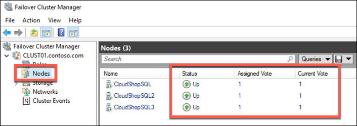

### Task 2: Create the SQL Server Availability Group

1. On CloudShopSQL, launch **SQL Server Configuration Manager**.

2. Select **SQL Server Services**, then right-click **SQL Server (MSSQLSERVER)** and select **Properties**.

    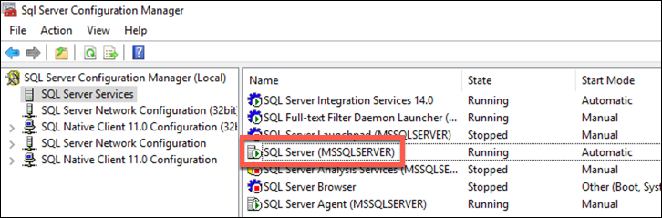

3. Select the **Log On** tab. To setup a SQL Server Availability     Group, the SQL Server service account needs to have access to all of the SQL Servers that will participate in the Availability Group. Change the service account to the **CONTOSO\\demouser** domain account using **demo@pass123** for the password.

    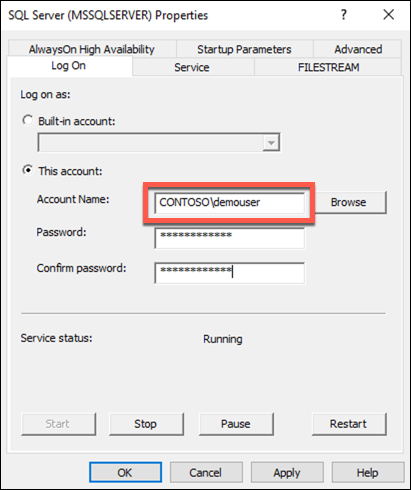

4. Select the **AlwaysOn High Availability** tab and check the box for **Enable AlwaysOn Availability Groups**, then select **OK**, then select **Yes** to confirm the account change.

    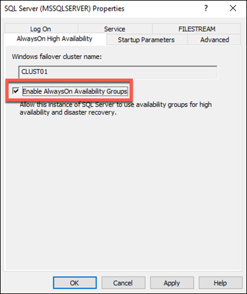

5. Restart the SQL Server service by right-clicking the service and choosing **Restart**.

    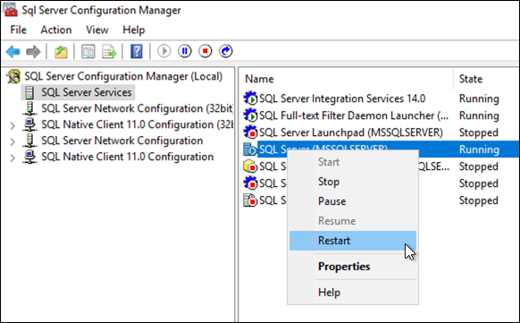

6. Repeat this configuration for **CloudShopSQL2** and **CloudShopSQL3**.

7. The database you will be replicating has its data and log files in the **C:\\Data** folder and the **C:\\Logs** folder on CloudShopSQL. We need to verify that the same folder structure exists on our secondary servers, CloudShopSQL2 and CloudShopSQL3. Login to **CloudShopSQL2** and **CloudShopSQL3** and verify that these folders exist. If they do not exist, create them.

8. Open a remote desktop connection to the CloudShopSQL virtual machine and login using the **CONTOSO\\demouser** account. Note that this demouser account is the domain administrator account. You must type the domain name in, otherwise you will be logged in with the local administrator account.

9. Your SQL Server Availability Group will require a file share to be used for the initial synchronization. Open up File Explorer and
    create a new folder in the root of the C: drive called **AG**.

10. Right-click the new folder and select **Share with \> Specific people...**

    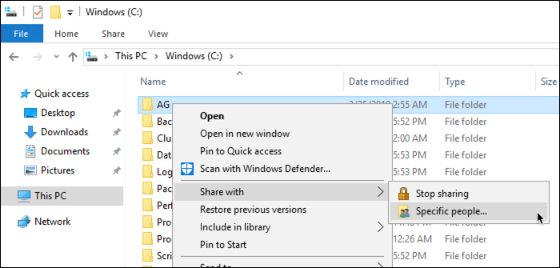

11. On the File Sharing window, select **Administrators** and select **Share**, then select **Done**.

12. Launch **SQL Server Management Studio** and connect to **CloudShopSQL**.

13. Expand the databases folder, right-click the **AdventureWorks** database and select **Properties**.

14. On the Database Properties window, select **Options** then set the recovery model to **Full** and select the **OK** button. The full recovery model is required for databases that participate in SQL Server Always On Availability Groups.

    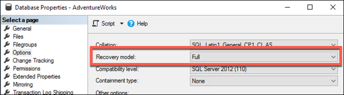

15. Right-click the **AdventureWorks** database, select **Tasks** and choose **Back Up...**.

    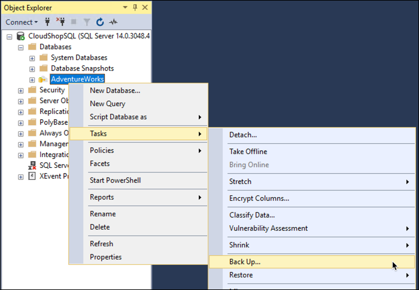

16. On the Back Up Database - AdventureWorks window, choose to backup to disk, select **Add**, and set the destination to **C:\\Data\\AdventureWorks.bak**, then select **OK** and select **OK** again to initiate the backup.

    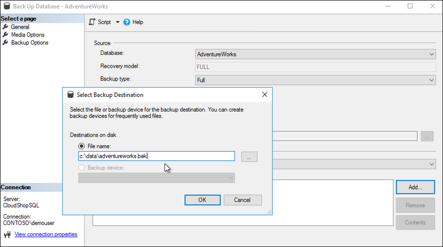

17. From the SQL Server Management Studio CloudShopSQL connection, right-click **AlwaysOn High Availability** then select **New Availability Group Wizard...**
    
    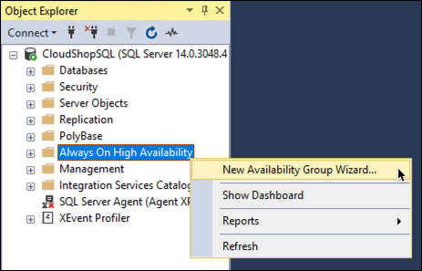

18. Select **Next** on the Introduction screen.

19. Specify **AdventureWorks** for the name of the availability group and select **Next**.

    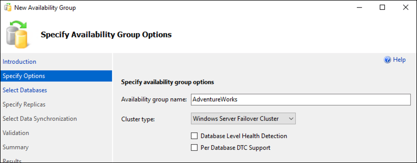

20. Double-click the password field next to the **AdventureWorks** database and enter the password **demo@pass123** and select **Refresh**. The status of the database should state that it \"Meets prerequisites\" meaning that the database is in Full recovery mode and that you have supplied the correct password for the database master key. Select **Next**.

    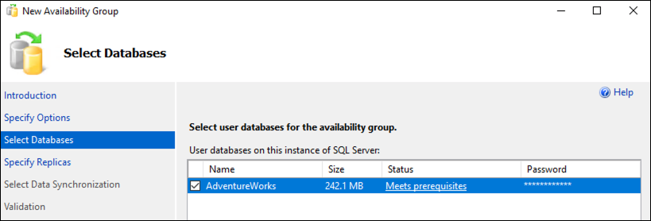

21. On the Specify Replicas tab, select the **Add Replica...** button and connect to CloudShopSQL2 and CloudShopSQL3.

    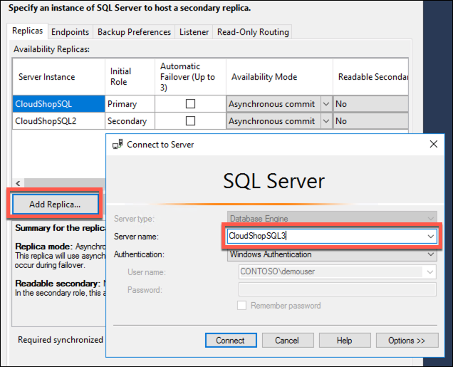

22. Select the **Listener** tab, select the **Create an availability group listener** radio button, set the following values for the
    listener, then select **Add**.

    - Listener DNS Name: **AdventureWorks**

    - Port: **1433**

    - Network Mode: **Static IP**

        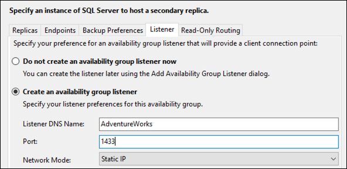

23. You will need to add two IP addresses for the listener, for the first use **10.0.1.8** and for the other use **172.16.1.8**, then select **Next**.

    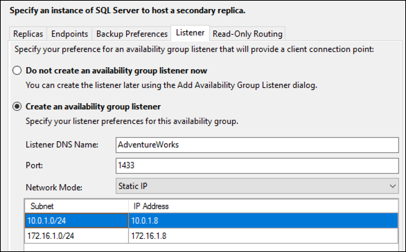

24. Ensure that **Full database and log backup** is selected and use **\\\\CloudShopSQL\\ag** for the network share. Select **Next** to continue.

    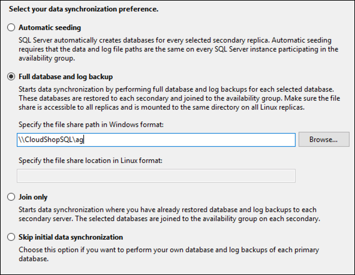

25. The validation tests will run automatically. They should all show success. Select **Next**.

    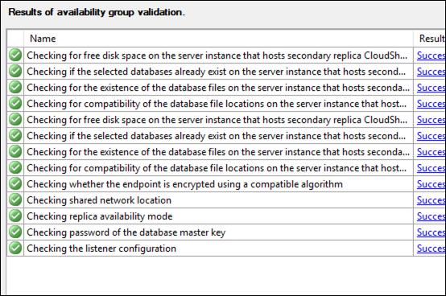

26. Verify your configuration then select **Finish** to build the Availability Group. Select **Close** after the wizard completes.

### Task 3: Create the Internal Load Balancer

1. In the Azure Portal, navigate to the **CloudShop2** resource group and select **Add**.

2. Type **Load Balancer** into the search bar then choose the **Load Balancer** and select **Create**.

    

3. On the Create load balancer blade, configure the following options, then select **Review + Create**:

    - Subscription: ***Your subscription***.
    - Resource group: **CloudShop2**
    - Name: **sqlag**
    - Region: ***Choose the region you have used for this lab***.
    - Type: **Internal**
    - SKU: **Basic**
    - Virtual network: **VNET2**
    - Subnet: **Data**
    - IP address assignment: **Static**
    - Private IP address: **172.16.1.8**

        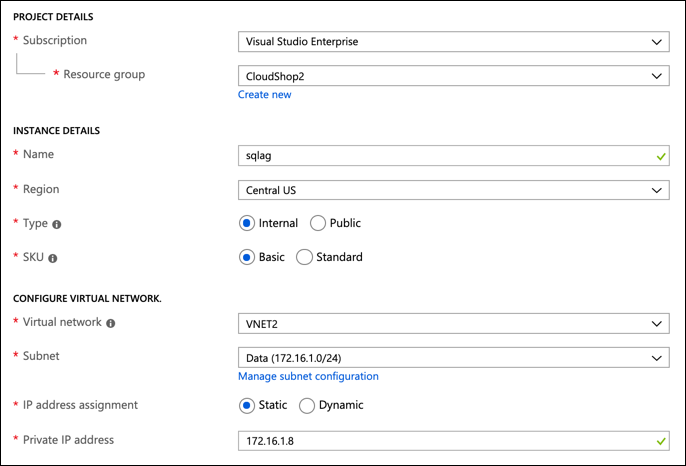

4. Navigate back to your resource group and select the **sqlag** load balancer you just created.

5. On the sqlag load balancer blade, select **Backend pools**, then select the **+Add** button.

    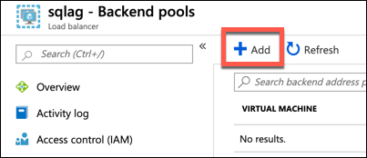

6. On the Add backend pool blade, use the following configurations:

    - Name: **sqlpool**
    - IP version: **IPv4** 
    - Associated to: **Availability set**
    - Availability set: **SQLAvSet2**

        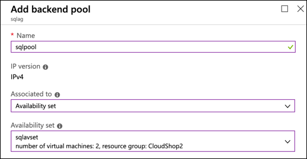

7.  select the **+ Add a target network IP configuration** button.

    

8.  Select **CloudShopSQL2** for the Target virtual machine, and select **ipconfig1 (172.16.1.5)** for the Network IP configuration. 
   
    >**Note**: Your IP address may be different than our example.

    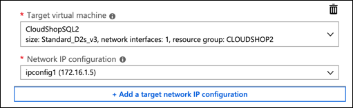

9.  Repeat steps 7-8 to add **CloudShopSQL3**. DO NOT ADD other machines to the backend pool. Select **OK** then wait for the load balancer to complete the update.

10. On the sqlag load balancer blade, select **Health Probes** and select the **+Add** button.

11. On the Add health probe blade, use the following configuration values then select **OK** and wait for the load balancer to complete
    the update.

    >**Note**: If you receive an error your load balancer may still be updating itself from the prior step. Wait a minute and try again.

    - Name: **sqlprobe** 
    - Protocol: **TCP** 
    - Port: **59999** 
    - Interval: **5** 
    - Unhealthy threshold: **2** 

        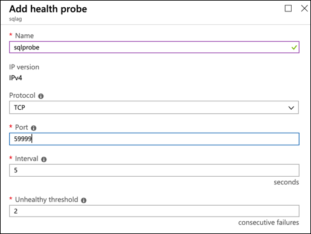

12. On the sqlag load balancer blade, select **Load balancing rules** and then select the **+Add** button.

13. On the Add load balancing rule blade, use the following configuration values then select **OK** and wait for the load balancer to complete the update.

    - Name: **sqlrules**
    - IP Version: **IPv4**
    - Frontend IP address: **172.16.1.8 (LoadBalancerFrontEnd)**
    - Protocol: **TCP**
    - Port: **1433**
    - Backend port: **1433**
    - Backend pool: **sqlpool**
    - Probe: **sqlprobe**
    - Session persistence: **None**
    - Idle timeout: **4**
    - Floating IP: **Enabled**

        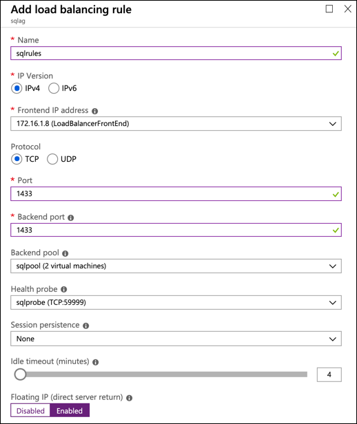

14. Next we need to verify our cluster's network names. Open the **Failover Cluster Manager**, expand **CLUST01**, select **Networks** then double-select **Cluster Network 2** to open the properties. Verify that Cluster Network 2's subnet is set to **172.16.1.0/24**. In some cases, the cluster deployment may reverse the names it assign to the cluster networks. If your subnet does not match here, then you will simply change the name of the cluster network in the script below to reflect this.
    
    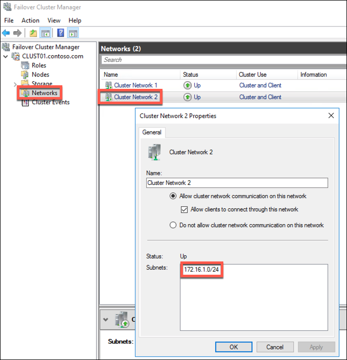

15. Open an **Administrative** PowerShell ISE session on **CloudShopSQL2**.

16. Copy the following PowerShell script to the script window. If your Cluster Network 2 did not match the 172.16.1.0/24 subnet, then change the $ClusterNetworkName variable to \"Cluster Network 1\". If your subnet did match then you do not need to make this change. Execute the script to configure your cluster for the probe port:

    ```powershell
    $ClusterNetworkName = "Cluster Network 2"

    $IPResourceName = "AdventureWorks_172.16.1.8"

    $ILBIP = "172.16.1.8"

    Import-Module FailoverClusters

    Get-ClusterResource $IPResourceName | Set-ClusterParameter -Multiple @{"Address"="$ILBIP";"ProbePort"="59999";"SubnetMask"="255.255.255.255";"Network"="$ClusterNetworkName";"EnableDhcp"=0}

    Stop-ClusterResource -Name "AdventureWorks_172.16.1.8"
    Stop-ClusterResource -Name "AdventureWorks"
    Start-ClusterResource -Name "AdventureWorks"
    ```

### Task 4: Validate the Availability Group 

1. Login to your CloudShopSQL virtual machine and launch SQL Server Management Studio.

2. From Object Explorer, launch a new connection and connect to the **AdventureWorks** listener. This is simply to check if your listener is actually working.

3. From your CloudShopSQL connection, expand Always On High Availability, Availability Groups, AdventureWorks, Availability Replicas, then right-click **CloudShopSQL2** and choose **Properties**.

    

4. On the properties window, change the availability mode to **Synchronous commit** and then select **OK**.

    Switching to synchronous commit allows us to failover without data loss. If we leave it in asynchronous mode, the failover would be "forced" which also implies some loss of data and invalidates the old primary replica. Since we are only testing functionality of our listener we DO NOT want to break the Availability Group replication.  

    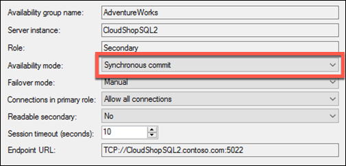

5. Repeat the above for **CloudShopSQL**. This will enable synchronous commits between the two replicas allowing us to failover without breaking the Availability Group replication.

6. Right-click the **AdventureWorks** Availability Group, and choose **Show Dashboard** from the menu.

    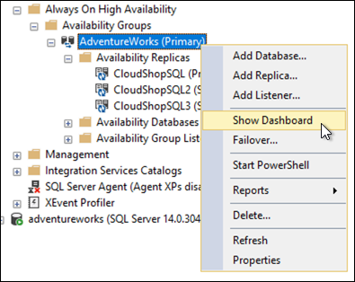

7. The dashboard should show both **CloudShopSQL** and **CloudShopSQL2** with a status of **Synchronized**.

    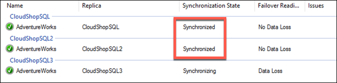

8. Right-click the **AdventureWorks** Availability Group again and choose **Failover...** from the menu.

    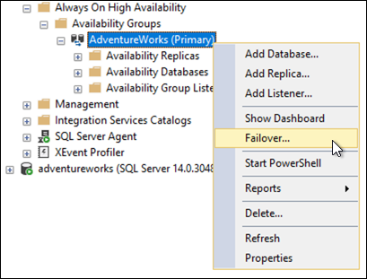

9. In the Failover Wizard, select **Next** on the first screen.

10. On the Select New Primary Replica window, select **CloudShopSQL2** and then select **Next**.

    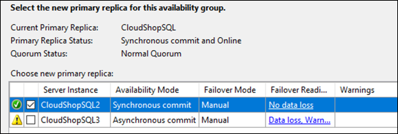

11. On the Connect to Replica window, connect to **CloudShopSQL2** with the **CONTOSO\demouser** account and select **Next**.

    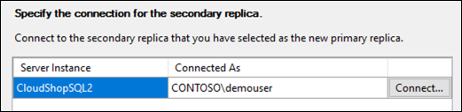

12. On the summary window, select **Finish**, then select **Close** on successful completion of the failover.

13. From CloudShopSQL2 or CloudShopSQL3, connect to your **AdventureWorks** listener and open a new Query Window by selecting connect in SSMS and using AdventureWorks for the server name.

    >**Note**: We must test from the same virtual network as our Internal Load Balancer. Internal Load Balancers do not currently support connectivity across peered networks.

14. Run the following code to verify that you are running from CloudShopSQL2:

    ```sql
    SELECT @@SERVERNAME
    ```

    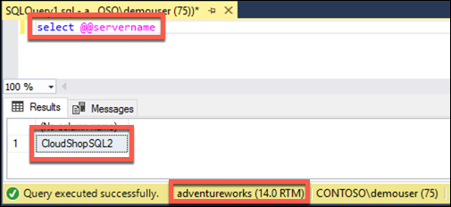

15. Use the Failover Wizard to fail **AdventureWorks** back to CloudShopSQL.

### Task 5: Update the Web Application to Connect to the Listener

1. Login to your CloudShopWeb virtual machine.

2. Launch File Explorer and navigate to **C:\inetpub\wwwroot**.

3. Open the **web.config** file in Notepad.

4. Edit the connection string to connect to the **AdventureWorks** listener.

    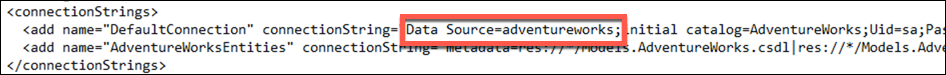

5. Save the file.

6. Launch a command prompt and execute **iisreset**.

### Summary

In this exercise, you deployed a Windows Failover Cluster and a SQL Always-On Availability Group for database resiliency. Also, you deployed and configured an internal load balancer to support the Availability Group in Azure. Finally, you validated your configuration by failing over to one of your secondary nodes and connecting to the Availability Group Listener.

## Exercise 5: Configure Azure Site Recovery for Web Tier DR 

Duration: 15 minutes

In this exercise, you will configure Azure Site Recovery to protect your web application and allow it to fail to your disaster recovery site.

### Task 1: Create a Recovery Services Vault

1. From the Azure portal, select **+Create a resource** from the menu on the left.

2. In the search box, type **Backup and site recovery** and then select **Backup and Site Recovery** from the results.

3. Select the **Create** button on the information blade.

4. On the Recovery Services vault creation blade, use the following configurations and select **Review + create**.

    - Subscription: ***Choose your subscription***.
    - Resource group: **CloudShop2**
    - Vault name: **RSVault**
    - Region: ***Use the same region assigned to CloudShop2***.

        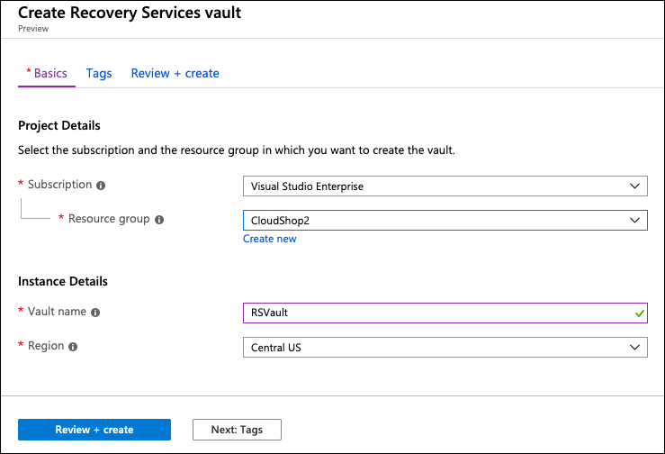

5. On the Review and create tab select **Create**.

### Task 2: Configure Azure Site Recovery

1. In the Azure Portal navigate to the Recovery Services vault you just created.
   
2. Select **Site recovery infrastructure** from the menu on the left and then choose **Network mapping**.

3. Select the **+Add mapping** button. Set your source network to VNET1 and your target network to VNET2.

    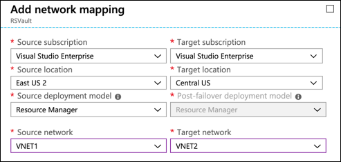

4. In the Recovery Services vault blade, select **Site Recovery** under **Getting started**.

    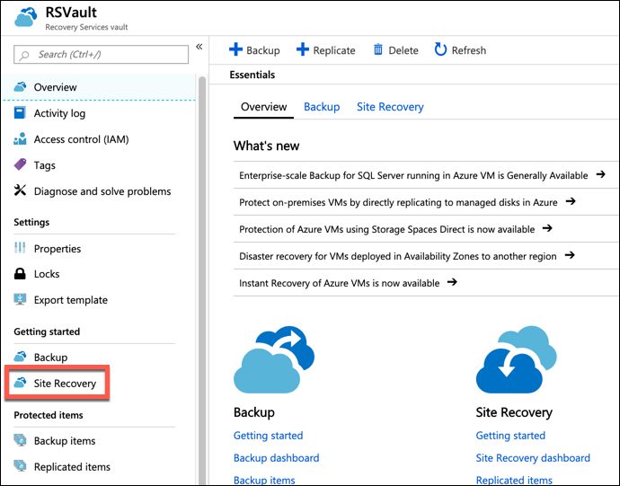

5. Under **FOR ON-PREMISES MACHINES AND AZURE VMS** select **Step 1: Replicate Application**.

    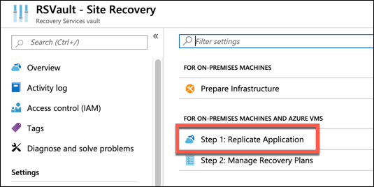

6. Choose the following configurations and select **OK**.

    - Source: **Azure**
    - Source location: ***The location of your CloudShop1 resource group***.
    - Azure virtual machine deployment model: **Resource Manager**
    - Source subscription: ***Your subscription***.
    - Source resource group: **CloudShop1**

        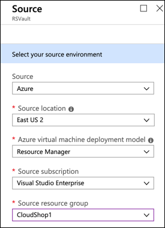

7. On the select virtual machines blade, select the **CloudShopWeb** virtual machine for replication. We will only use Azure Site Recovery to protect the web servers. Select the **OK** button.

    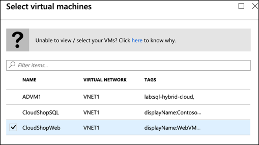

8. On the Configure settings blade, set the Target location to the location of your CloudShop2 resource group. 

9. Select the **Customize** link.

    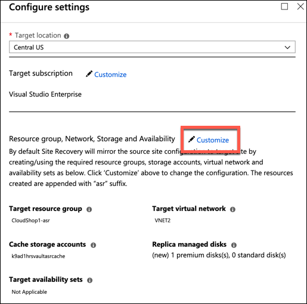

10. Change the target resource group to **CloudShop2**.

    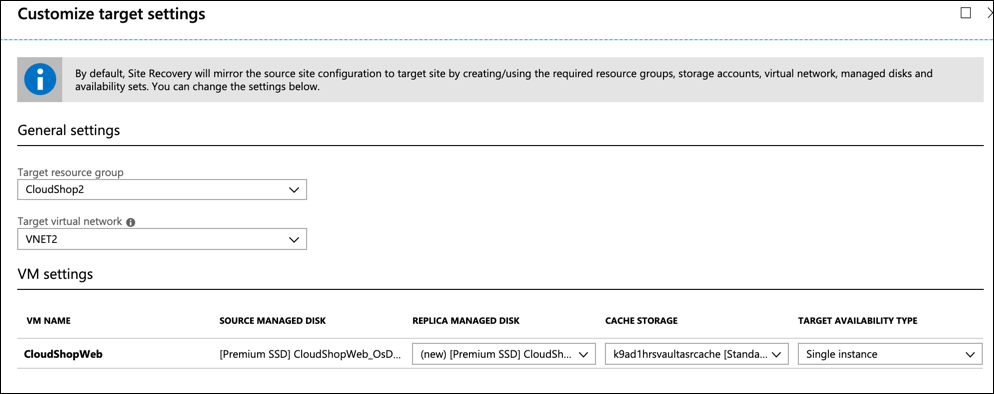

11. Select **Create target resources**.

    >**Note**: Do not close the blade. It will close by itself after the target resources are created (2-3 minutes).

    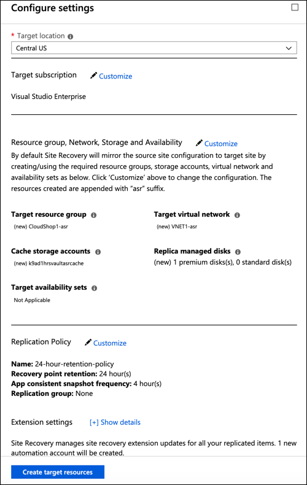

12. On the Enable Replication blade, select the **enable replication** button. 

13. Several Site Recovery jobs will be initiated which are creating the replication policy as well as the target resources to be used during a failover. Select **Site recovery jobs** to view the job progress.

    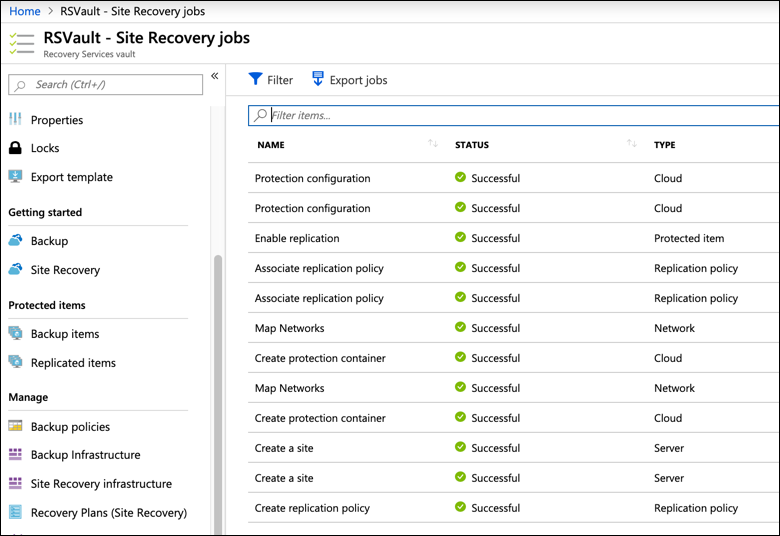

14. Once all the jobs are successful, select **Replicated items** under **Protected Items** to view the status of the initial replication.

    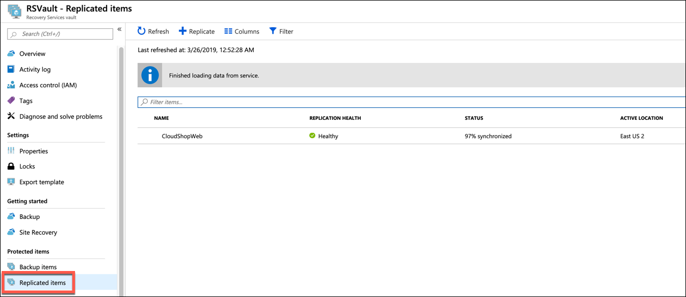

15. While waiting for the initial replication/synchronization, move on to the next task.

### Task 3: Creating the Recovery Plan

In this task, you will create the recovery plan that will be used to orchestrate failover action for the web tier.

1. Within the properties of the Recovery Services vault, select **Recovery Plans (Site Recovery)** under Manage.

    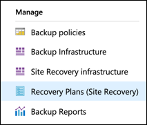

2. Select the **+Recovery Plan** button.

3. On the Create recovery plan blade enter the name **CloudShopRP**. In the Source area select the region where your CloudShop1 resource group is deployed. The Target will be automatically selected. Under Allow items with deployment model, select **Resource Manager**. Choose Select items and select the Virtual Machine. Select **OK** and then select **OK** on the Create recovery plan blade.

    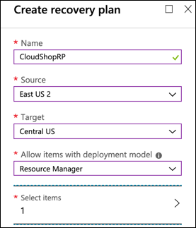

4. After a minute or two, you should see the CloudShopRP on the Recovery plans blade. This recovery plan will bring up your web server during a failover. 

5. Now go back to the Recovery Services vault RSVault - Overview blade. Select Site Recovery. Notice that the CloudShopWeb virtual machine is replicating. Take note of the status. It should be close to 100%. You will not be able to continue until it is finished replicating. 

   >**Note**: This may take up to an hour.

    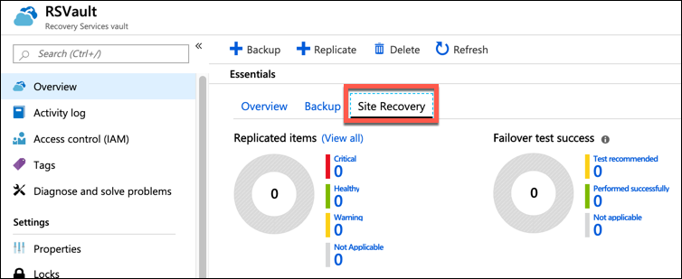

## Exercise 6: Failing Over to the Disaster Recovery Site 

Duration: 30 minutes

In this exercise, you will fail over to your disaster recovery site.

### Task 1: Failover the Data Tier

1. Login to your CloudShopSQL virtual machine and launch SQL Server Management Studio.

2. Open a connection to your CloudShopSQL instance, expand Always On High Availability, Availability Replicas, then right-click **CloudShopSQL2** and choose **Properties**.

    

3. On the properties window, change the availability mode to **Synchronous commit** and then select **OK**. Note that in a real outage scenario it may not be possible to use this method and may require a forced failover which may incur some data loss.  

    

4. Repeat the above for **CloudShopSQL**. This will enable synchronous commits between the two replicas allowing us to failover without breaking the Availability Group replication.

5. Right-click the **AdventureWorks** Availability Group and choose **Failover...** from the menu.

    

6. In the Failover Wizard, select **Next** on the first screen.

7. On the Select New Primary Replica window, select **CloudShopSQL2** and then select **Next**.

    

8. On the Connect to Replica window, connect to **CloudShopSQL2** with the **CONTOSO\demouser** account and select **Next**.

    

9. On the summary window, select **Finish**, then select **Close** on successful completion of the failover.

### Task 2: Failover the Web Tier

To fail over the entire environment requires the database server to be up, then the web server may come online. After successfully failing over the data tier in the previous step we will now failover the web tier via ASR. 

1. From the Azure portal, navigate to your **RSvault** resource.

2. Select **Recovery Plans (Site Recovery)** from the menu on the left.

    

3. Select your **CloudShopRP** recovery plan.

4. On the CloudShopRP recovery plan blade, select the **...More** button, and then select **Failover** from the dropdown menu.

    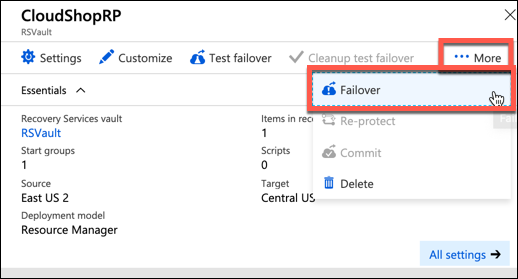

5. Check the box next to **I understand the risk**.

6. Verify your failover settings and select **OK**.

    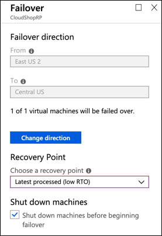

7. You can monitor the status of your failover by selecting **Site recovery jobs** from the monitoring section of the menu on the left.

8. After the failover completes, navigate to the **CloudShop2** resource group and open your **CloudShopWeb** virtual machine.

9. Notice that it does not have a Public IP address. Select **Networking** on the menu to the left.

    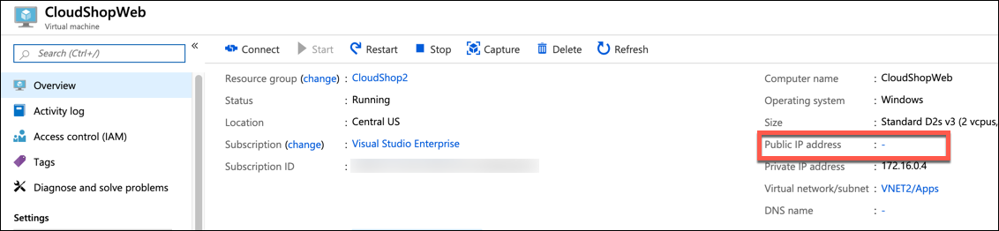

10. Select the **CloudShopWebNetworkInterface**.

    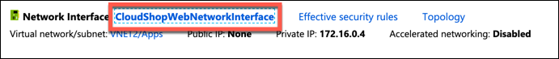

11. Select **IP Configurations** from the menu.

    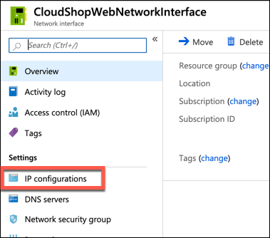

12. Change the **Public IP address settings** to **Enabled**, then create a new public IP address called **webpubip**. Select **OK** and **Save**.

    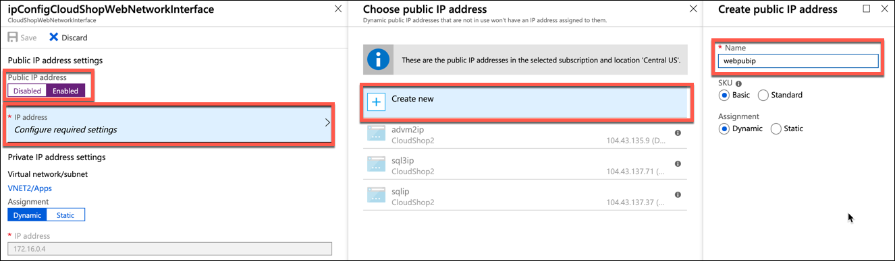

13. Open a command prompt and issue an **iisreset** to restart the web service.

### Task 3: Validate Failover of the CloudShop application 

1. From the Azure portal, navigate to the **CloudShopWeb** virtual machine.   

2. Copy the **Public IP address** and paste it into a browser to verify that your site is working.

## After the hands-on lab

### Task 1: Delete the resource groups created

1. Within the Azure portal, select Resource Groups on the left navigation.

2. Delete each of the resource groups created in this lab by selecting them followed by selecting the Delete Resource Group button. You will need to confirm the name of the resource group to delete.

You should follow all steps provided *after* attending the hands-on lab.
